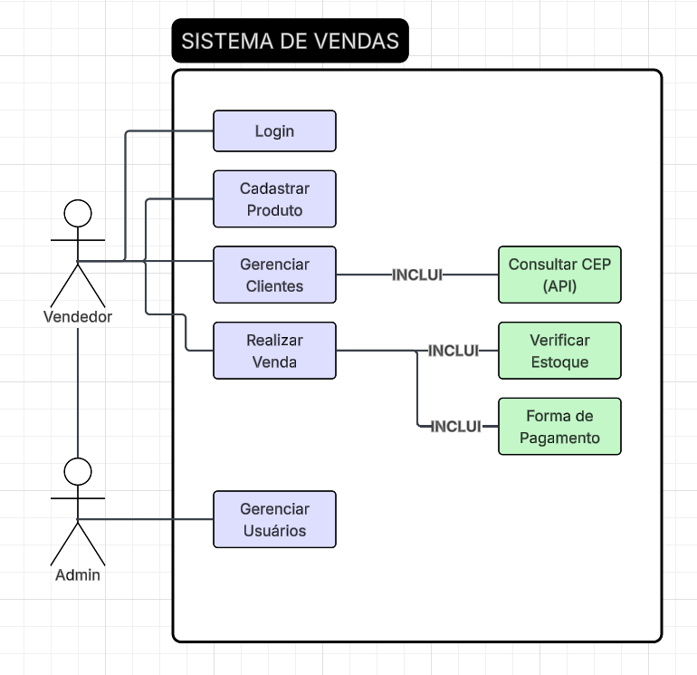
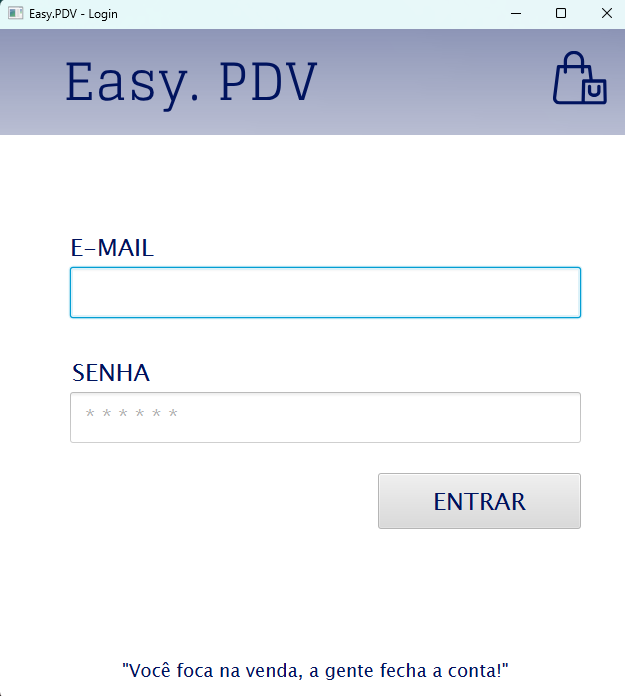
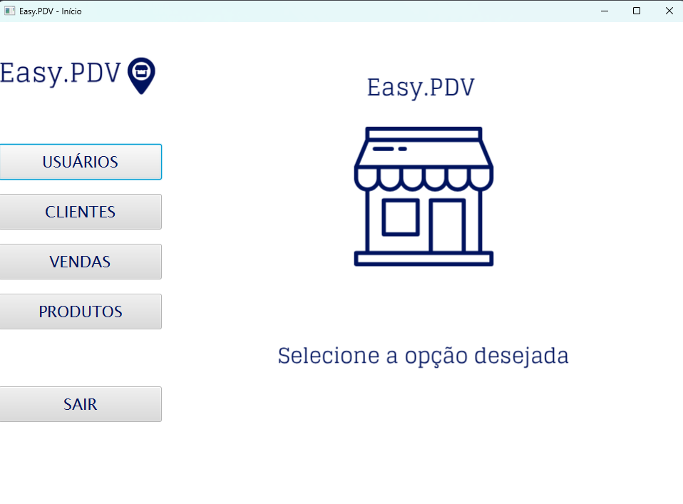
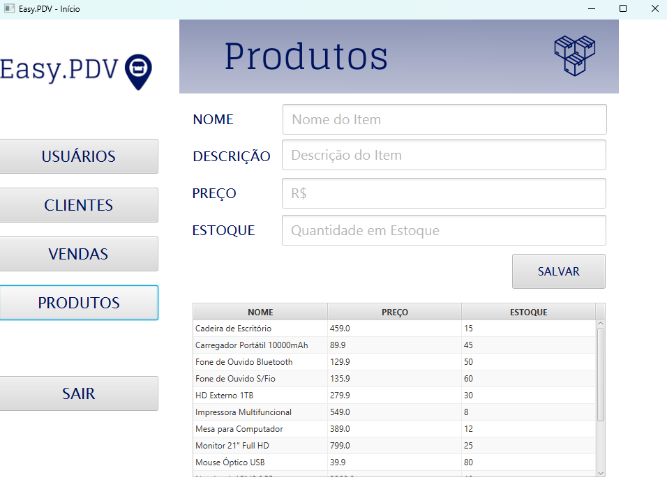
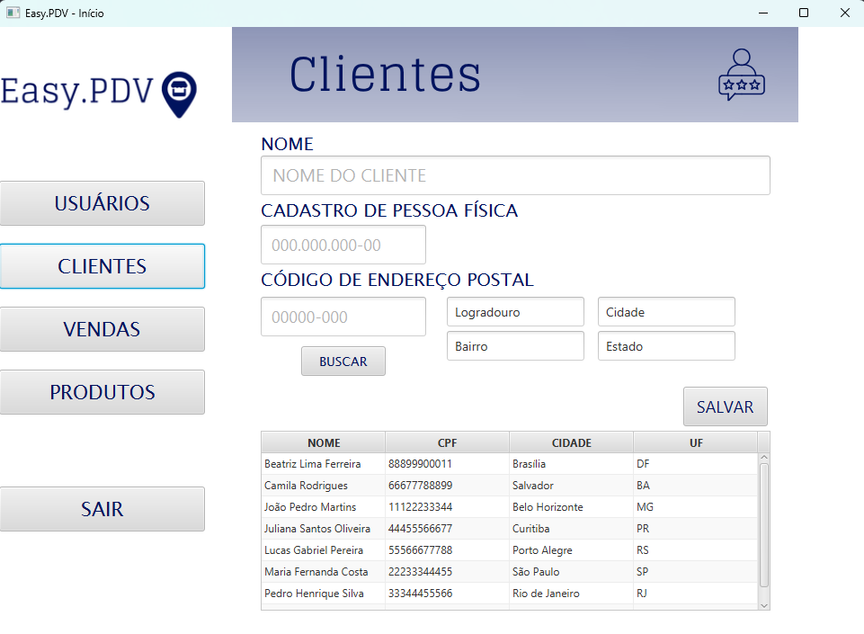
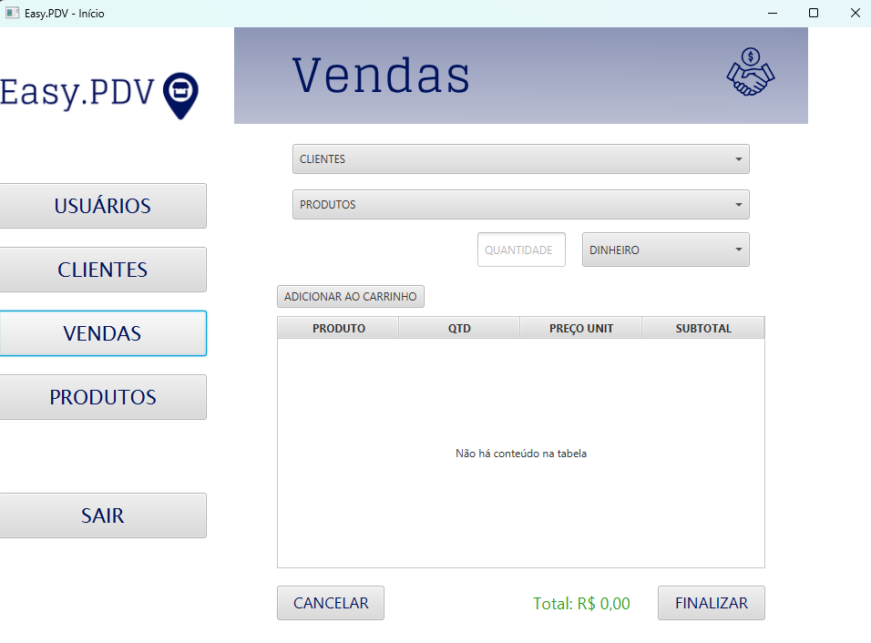
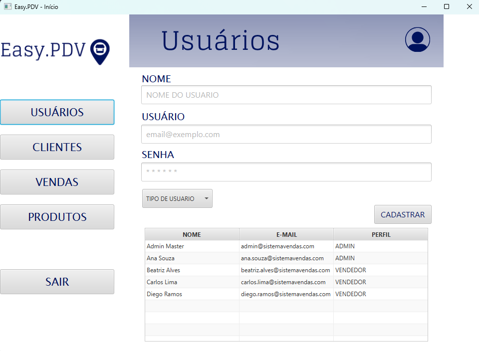

<div align="center">

# 🛒 Easy.PDV

### Sistema de Vendas Online — Projeto Educacional

*"Você foca na venda, a gente fecha a conta."*


</div>

---

## 📖 Sobre o Projeto

**Easy.PDV** é um sistema desktop de PDV (Ponto de Venda) desenvolvido em **Java 21 + JavaFX**, com persistência em **MySQL**, criado como projeto educacional no curso de **Análise e Desenvolvimento de Sistemas pelo SENAI CTTI**.

O sistema cobre o fluxo completo de um pequeno comércio, do login ao fechamento da venda:

- 🔐 Login com controle de acesso por perfil (Admin / Vendedor)
- 📦 Cadastro de produtos com controle de estoque
- 🧑‍🤝‍🧑 Cadastro de clientes com preenchimento automático de endereço via **API pública (ViaCEP)**
- 💳 Registro de vendas com carrinho, múltiplas formas de pagamento e baixa de estoque transacional
- 👥 Gerenciamento de usuários (exclusivo do Admin)

Desenvolvido em dupla, com foco em boas práticas de arquitetura em camadas, regras de negócio isoladas do domínio e segurança básica (senhas com hash BCrypt, prevenção de SQL Injection via `PreparedStatement`).

---

## 📑 Sumário

- [Diagrama de Caso de Uso](#-diagrama-de-caso-de-uso)
- [Arquitetura do Projeto](#-arquitetura-do-projeto)
- [Telas e Funcionalidades](#️-telas-e-funcionalidades)
- [Regras de Negócio](#️-regras-de-negócio-resumo)
- [Sacadas e Decisões de Design](#-sacadas-e-decisões-de-design)
- [Modelo de Dados](#️-modelo-de-dados)
- [Tecnologias Utilizadas](#️-tecnologias-utilizadas)
- [Como Rodar](#️-como-rodar)

---

## 📐 Diagrama de Caso de Uso

Este diagrama resume os dois perfis de acesso do sistema (Vendedor e Admin) e o que cada um pode fazer.



---

## 🧱 Arquitetura do Projeto

O sistema segue o padrão **MVC (Model-View-Controller)**, com uma camada **DAO** separando o acesso ao banco de dados, e uma camada **Service** para integrações externas.

```
src/main/java/br/com/senai/
├── app/            → MainApp (ponto de entrada) e NavegadorApp (troca de telas)
├── controller/     → Um Controller por tela (FXML), contém a lógica de interface
├── dao/            → Um DAO por entidade, isola todo o SQL/JDBC
├── model/          → Classes de domínio (Cliente, Produto, Usuario, Venda...)
└── service/        → Integrações externas (ex.: CepService com a API ViaCEP)

src/main/resources/
├── fxml/           → As telas (arquivos .fxml, editados no Scene Builder)
└── database.properties (não versionado — veja "Como Rodar")
```

> 💡 **Por que essa separação?** Cada Controller só conhece a tela e delega tudo que é regra de negócio para o Model (ex.: `Produto.baixarEstoque()`, `Venda.adicionarItem()`) e tudo que é banco de dados para o DAO correspondente. Isso significa que a lógica de "não pode vender sem estoque", por exemplo, mora em um único lugar (`Produto`) e é reaproveitada tanto pela `Venda` quanto, indiretamente, pelo `VendasController` — sem duplicar validação em nenhuma tela.

O `NavegadorApp` centraliza a troca de telas (`trocarTela`) e guarda o usuário logado em memória (um pequeno "estado global" da aplicação), evitando que cada Controller precise saber como abrir a próxima tela.

---

## 🖥️ Telas e Funcionalidades

### 1️⃣ Login

Tela de entrada do sistema. Autenticação por e-mail e senha.



**Funcionalidades:**
- Autenticação por e-mail + senha.
- Senha nunca é comparada em texto puro: é validada com **BCrypt** (`usuario.verificarSenha()`).
- Mensagem de erro **genérica** ("E-mail ou senha inválidos") tanto para e-mail inexistente quanto para senha errada — evita informar a um atacante se o e-mail existe na base ou não.
- Ao logar com sucesso, o usuário fica guardado em `NavegadorApp.usuarioLogado` e o sistema navega para a tela Principal.

---

### 2️⃣ Tela Principal (Dashboard / Menu)

Tela "casca" do sistema: um menu lateral fixo com um `AnchorPane` central onde as outras telas são carregadas dinamicamente.



**Funcionalidades:**
- Menu lateral com acesso a Produtos, Clientes, Vendas e Usuários.
- **Controle de acesso por perfil**: o botão "Usuários" só fica visível (`setVisible` + `setManaged`) se o usuário logado for `ADMIN`. Um `VENDEDOR` nem sabe que essa tela existe.
- Botão "Sair" limpa o usuário logado e retorna para a tela de Login.
- Cada botão do menu carrega o FXML correspondente **dentro** da área de conteúdo (sem trocar a janela inteira), reaproveitando o `AnchorPane areaConteudo`.

---

### 3️⃣ Produtos

Cadastro e listagem do catálogo de produtos vendidos.



**Funcionalidades:**
- Cadastro de produto: nome, descrição, preço e quantidade em estoque.
- Aceita preço digitado tanto com vírgula quanto com ponto (`"10,50"` ou `"10.50"`).
- Validação de números: se preço ou estoque não forem números válidos, mensagem de erro amigável (sem travar a aplicação com exception não tratada).
- Tabela abaixo do formulário lista todos os produtos já cadastrados, atualizada automaticamente após cada salvamento.

> ⚠️ **Regra de negócio:** estoque **nunca** pode ser negativo — validado dentro da própria classe `Produto` (`setQuantidadeEstoque`), não na tela. Isso garante que a regra vale mesmo que, no futuro, outra tela ou outro processo tente alterar o estoque.

---

### 4️⃣ Clientes

Cadastro de clientes com preenchimento automático de endereço.



**Funcionalidades:**
- Cadastro em **duas etapas**: (1) digita nome, CPF e CEP e clica em "Buscar" → o sistema consulta a **API pública ViaCEP** e preenche logradouro, bairro, cidade e UF automaticamente; (2) confere os dados e clica em "Salvar".
- Campos de endereço ficam **bloqueados para edição** (`editable="false"`), pois vêm direto da API — evita que o vendedor digite um endereço divergente do CEP.
- Validações: CPF precisa ter 11 dígitos (aceita com ou sem pontuação — o sistema limpa `[^0-9]` antes de validar), CEP precisa ter 8 dígitos.
- Tratamento de erros da API: CEP inexistente gera mensagem própria (`CepNaoEncontradoException`), falha de conexão gera outra mensagem, sem nunca quebrar a tela.
- Tabela lista todos os clientes já cadastrados.

---

### 5️⃣ Vendas

A tela mais complexa do sistema: monta um carrinho em memória e só grava tudo no banco ao finalizar.



**Funcionalidades:**
- Seleção de Cliente, Produto, Quantidade e Forma de Pagamento (Dinheiro ou Cartão).
- Ao adicionar o **primeiro** item, a venda é "travada": Cliente e Forma de Pagamento ficam desabilitados até a venda ser finalizada ou cancelada — evita trocar o cliente no meio de uma venda já iniciada.
- Cada produto no ComboBox mostra o estoque disponível em tempo real (ex.: `"Mouse Óptico USB - Estoque: 80"`).
- Botão "Adicionar ao Carrinho" valida quantidade (precisa ser inteiro positivo) e estoque disponível antes de aceitar o item.
- Tabela do carrinho mostra produto, quantidade, preço unitário e subtotal — com o **valor total** da venda recalculado a cada item.
- **Finalizar Venda**: grava a venda inteira (cabeçalho + itens) numa única transação e persiste a baixa de estoque de cada produto envolvido.
- **Cancelar Venda**: descarta o carrinho sem gravar nada no banco e recarrega as listas para desfazer a baixa de estoque "fantasma" que só existia em memória.

> ⚠️ **Regra de negócio central:** não é possível vender um produto sem estoque suficiente. Essa regra vive dentro de `Produto.baixarEstoque()` e é usada por `Venda.adicionarItem()` — a tela apenas chama esse método e mostra a mensagem de retorno, sem reimplementar a validação.

---

### 6️⃣ Usuários <sup>*(exclusiva do Admin)*</sup>

Cadastro de novos usuários do sistema (vendedores e administradores).



**Funcionalidades:**
- Cadastro de nome, e-mail, senha e perfil (`ADMIN` ou `VENDEDOR`), via `ComboBox` populado a partir do próprio `enum Perfil`.
- Senha é validada (mínimo 6 caracteres) e transformada em hash **BCrypt** dentro do construtor de `Usuario` — o `UsuarioController` nunca manipula a senha em texto puro além do instante da digitação.
- Trata erro de e-mail duplicado (constraint `UNIQUE` do banco) com mensagem amigável em vez de estourar exception na tela.
- Tabela lista todos os usuários cadastrados, com perfil.
- **Acesso restrito**: essa tela só é alcançável por usuários `ADMIN` — o botão que leva até ela fica escondido para `VENDEDOR` (ver Tela Principal).

---

## ⚖️ Regras de Negócio (resumo)

| Regra | Onde é garantida |
|---|---|
| Estoque nunca pode ser negativo | `Produto.setQuantidadeEstoque()` |
| Não é possível vender sem estoque suficiente | `Produto.baixarEstoque()` + `Venda.adicionarItem()` |
| Preço do item de venda é "congelado" no momento da compra | `ItemVenda` guarda `precoUnitario` na criação, não uma referência ao preço atual do `Produto` |
| CPF deve ter 11 dígitos | `Cliente.setCpf()` (remove pontuação antes de validar) |
| CEP deve ter 8 dígitos | `Cliente.setCep()` |
| E-mail precisa conter "@" | `Usuario.setEmail()` |
| Senha precisa ter no mínimo 6 caracteres, e é sempre armazenada como hash BCrypt | `Usuario.setSenha()` |
| Tela de Usuários só é visível para Admin | `PrincipalController.aplicarControleDeAcessoPorPerfil()` |
| Uma venda só é gravada por completo, ou nada é gravado (atomicidade) | Transação manual (`setAutoCommit(false)` + `commit()`/`rollback()`) em `VendaDAO.salvar()` |

---

## 💡 Sacadas e Decisões de Design

Algumas decisões que valem a pena destacar, tomadas ao longo do desenvolvimento:

- **Regra de negócio dentro do Model, não na tela.** Em vez de validar estoque ou CPF dentro do Controller (que é só interface), essas regras vivem nas classes de domínio (`Produto`, `Cliente`, `Usuario`, `Venda`). Isso significa que a regra vale sempre, não importa por qual tela (ou futura tela) o dado passe.
- **`ItemVenda` guarda o preço no momento da venda.** Se o preço do produto for reajustado depois, o histórico de vendas antigas não muda — decisão importante para manter a integridade de relatórios financeiros no futuro.
- **Transação manual na gravação da venda.** Como uma venda envolve duas tabelas (`venda` e `item_venda`), o `VendaDAO` desliga o auto-commit e só confirma tudo no final. Se algo falhar no meio do processo, um `rollback()` desfaz tudo — nenhuma venda "pela metade" fica salva.
- **Carrinho em memória antes de gravar.** A baixa de estoque acontece nos objetos `Produto` em memória assim que um item é adicionado ao carrinho (não espera finalizar a venda). Isso deixa a experiência do vendedor instantânea (o ComboBox já mostra o estoque atualizado), mas exige atenção ao cancelar a venda: `recarregarListas()` busca os dados reais do banco de novo, para não deixar um estoque "fantasma" na tela.
- **`StringConverter` nos ComboBox.** Em vez de sobrescrever o `toString()` das classes de domínio (que ficaria estranho de usar em logs/debug), a tela de Vendas usa `StringConverter` para decidir como cada Cliente/Produto aparece no ComboBox — mantém as duas responsabilidades separadas.
- **Mensagem de erro de login genérica de propósito.** "E-mail ou senha inválidos" é a mesma mensagem tanto para e-mail inexistente quanto para senha incorreta — uma pequena boa prática de segurança para não revelar quais e-mails estão cadastrados.
- **`NavegadorApp` como navegador central de telas.** Centralizar a troca de `Scene`/`Stage` numa única classe estática evitou que cada Controller precisasse conhecer detalhes de `Stage`, tamanho de janela, etc. — só chama `NavegadorApp.trocarTela(fxml, titulo)`.
- **Integração com API externa isolada em `CepService`.** Toda a lógica de HTTP e parsing de JSON da ViaCEP fica isolada numa única classe de serviço, com uma exceção própria (`CepNaoEncontradoException`) para diferenciar "CEP não existe" de "erro de conexão" — o Controller só precisa tratar dois cenários possíveis.

---

## 🗄️ Modelo de Dados

Banco de dados: **MySQL** (`sistema_vendas`).

| Tabela | Descrição |
|---|---|
| `usuario` | Login do sistema (vendedores e admins), senha em hash BCrypt |
| `produto` | Catálogo de produtos, com `CHECK` de estoque não-negativo |
| `cliente` | Clientes, endereço preenchido via API ViaCEP |
| `venda` | Cabeçalho da venda (quem comprou, quem vendeu, forma de pagamento, total) |
| `item_venda` | Itens de cada venda (tabela de ligação N:N entre venda e produto) |

Scripts disponíveis em `database/`:
- `database.sql` → criação do schema e das tabelas.
- `testes.sql` → popula o banco com dados fictícios para teste (usuários, produtos, clientes e vendas de exemplo).

---

## 🛠️ Tecnologias Utilizadas

| Tecnologia | Uso no projeto |
|---|---|
| ☕ **Java 21** | Linguagem principal |
| 🎨 **JavaFX 21** | Interface gráfica (telas em FXML, editadas no Scene Builder) |
| 🐬 **MySQL** + **MySQL Connector/J** | Persistência de dados |
| 🔒 **jBCrypt** | Hash de senha |
| 📦 **org.json** | Parsing do retorno da API ViaCEP |
| 🌐 **java.net.http.HttpClient** | Cliente HTTP nativo do Java, para consumir a API |
| 🧰 **Maven** | Gerenciamento de dependências e build |

---

## ▶️ Como Rodar

**Pré-requisitos:** Java 21 e Maven instalados.

1. **Clone o repositório**
   ```bash
   git clone <url-do-repositorio>
   ```
2. **Crie o banco de dados** executando o script `database/database.sql` no MySQL.
3. **(Opcional) Popule com dados de teste** executando `database/testes.sql`.
4. **Configure as credenciais do banco:**
   ```bash
   cp src/main/resources/database.properties.example src/main/resources/database.properties
   ```
   Depois, edite o arquivo com sua senha real do MySQL.
5. **Rode a aplicação via Maven:**
   ```bash
   mvn clean javafx:run
   ```
6. **Faça login** com um dos usuários de teste (se você rodou o `testes.sql`):

   | Perfil | E-mail | Senha |
   |---|---|---|
   | 👑 Admin | `admin@sistemavendas.com` | `admin123` |
   | 🧑‍💼 Vendedor | `carlos.lima@sistemavendas.com` | `vendedor123` |

---

<div align="center">

📚 *Projeto desenvolvido em dupla como atividade acadêmica do curso de Aperfeiçoamento em Linguagem de Programação Java — SENAI.*

</div>
